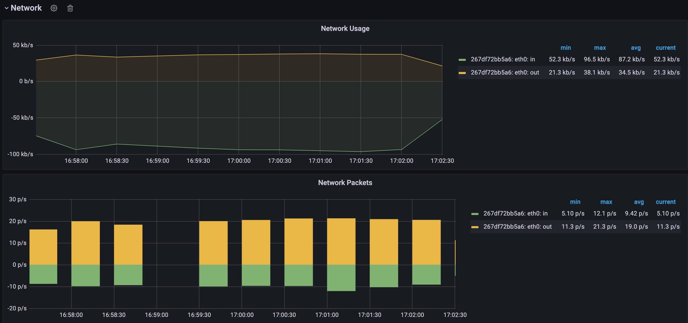
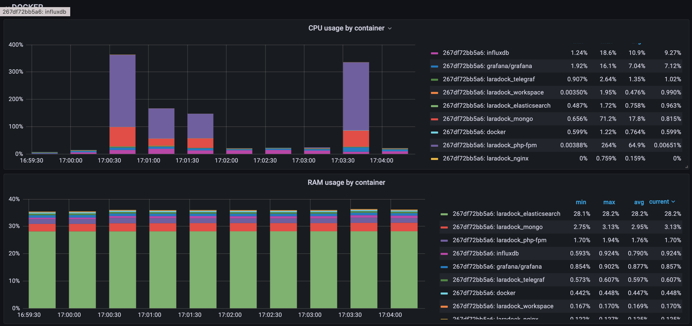
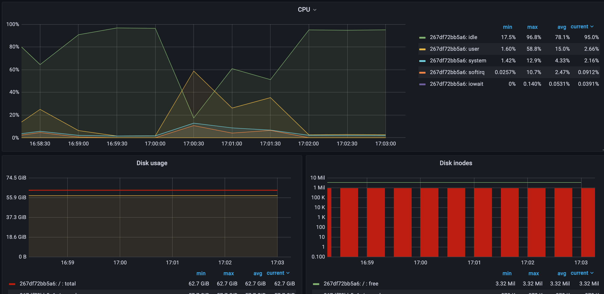
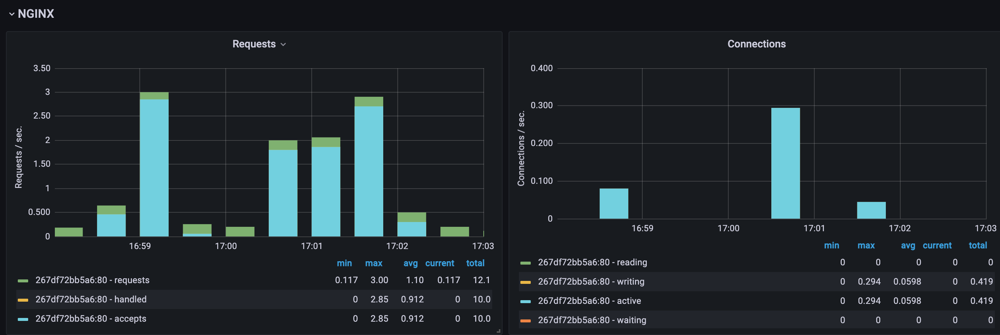
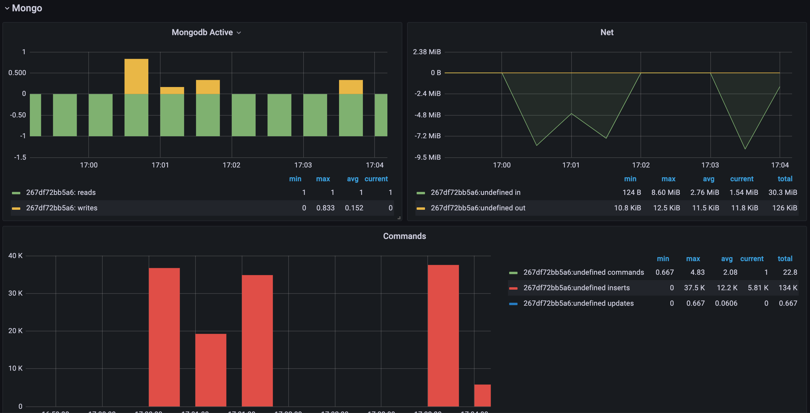

# HSA L2: Resource monitoring systems

This an example project to show the TIG (Telegraf, InfluxDB and Grafana) stack.

## First Time Prerequisites
Install [Siege](https://github.com/JoeDog/siege) benchmarking tool.
If you are using MacOS, you can install it via brew
```bash
  brew install siege
```

## Run the monitoring system
```bash
cd laradock

docker-compose up -d elasticsearch nginx php-fpm workspace mongo grafana telegraf influxdb
```

## To stop the monitoring system run
```bash
docker-compose down
```
##### or next command to remove with volumes
```bash
docker-compose down -v
```

## Services and Ports

### Grafana
- URL: http://localhost:3000
- User: admin
- Password: admin

## Run the PHP Example with benchmarking tool

```bash
siege -d1 -r100 -c10 localhost
```

The PHP example generates random example metrics. The random metrics are being sent to MongoDB

The telegraf agents aggregates the incoming data and periodically persists the data into the InfluxDB database.

Grafana connects to the InfluxDB database and is able to visualize the incoming data.   

## Sample Tests 
```bash
$ siege -d1 -r10 -c10 localhost
Transactions:		         100 hits
Availability:		      100.00 %
Elapsed time:		       40.73 secs
Data transferred:	        0.01 MB
Response time:		        3.49 secs
Transaction rate:	        2.46 trans/sec
Throughput:		        0.00 MB/sec
Concurrency:		        8.57
Successful transactions:         100
Failed transactions:	           0
Longest transaction:	       18.51
Shortest transaction:	        0.83
```





